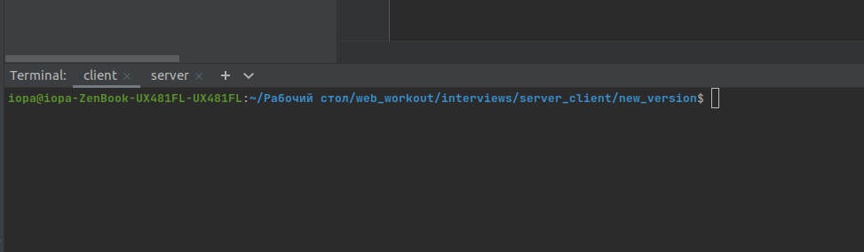

# Backend test
## Описание задачи: http://surl.li/blhnl

###Структура файлов проекта:

````
node_backend_test
|— client.js
|— server.js
|— utils.js
````
- client.js — файл запуска клиента ```npm run client```
- server.js - файл запуска сервера ```npm run server```
- utils.js - вспомогательные функции (Нахождение сред. ариф, медианное занч. и генератор статус сервера )
___

### Установка:
1. git clone
2. cd node_backend_test
___
### Запуск теста:
1. Открыть два терминала
2. Для удобства назвать: "server" и "client"
3. Вкладка "server"  | ```npm run server```
4. Вкладка "client"  | ```npm run client```


___